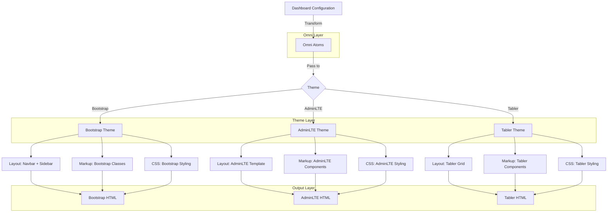

# Theme Unification with Omni

## Overview

To ensure consistency across multiple themes while allowing for theme-specific customizations, we're adopting the [Omni](https://github.com/dracory/omni) library. This document outlines how themes should be implemented to work with Omni.

## Core Concepts

### 1. Atoms

Atoms are the fundamental building blocks in Omni. Each atom has:
- A unique identifier (auto-generated if not provided)
- A type (required)
- Properties (key-value pairs)
- Child atoms (for hierarchical structures)

### 2. Properties

Properties store metadata or configuration for atoms as attribute-value pairs.

## Theme Interface

```go
type Theme interface {
    // Render an individual atom
    RenderAtom(atom *omni.Atom) (*hb.Tag, error)
    
    // Render a complete dashboard
    RenderDashboard(dashboard *omni.Atom) (string, error)
    
    // Get theme name
    GetName() string
    
    // Get theme assets
    GetCSSLinks(isDarkMode bool) []*hb.Tag
    GetJSScripts() []*hb.Tag
    GetCustomCSS() string
    GetCustomJS() string
}
```

## Data Flow



## How It Works

### 1. Data Flow

1. **Dashboard Configuration**
   - The application loads the dashboard configuration
   - This includes layout, components, and their properties

2. **Omni Transformation**
   - The dashboard config is transformed into Omni atoms
   - Each UI component becomes an atom with properties
   - This creates a theme-agnostic representation

3. **Theme Rendering**
   - The Omni atom tree is passed to the active theme
   - The theme traverses the atom tree and renders each atom
   - Themes apply their own markup and styling

### 2. Example Implementation

```go
// In your theme package
func (t *YourTheme) RenderAtom(atom *omni.Atom) (*hb.Tag, error) {
    switch atom.Type {
    case "button":
        return t.renderButton(atom)
    case "container":
        return t.renderContainer(atom)
    // Handle other atom types
    default:
        return nil, fmt.Errorf("unsupported atom type: %s", atom.Type)
    }
}

func (t *YourTheme) renderButton(atom *omni.Atom) (*hb.Tag, error) {
    btn := hb.NewButton()
    
    // Apply common button classes
    btn.Class("btn")
    
    // Apply variant if specified
    if variant, ok := atom.GetProperty("variant"); ok {
        btn.Class(fmt.Sprintf("btn-%s", variant))
    }
    
    // Add text content
    if text, ok := atom.GetProperty("text"); ok {
        btn.Text(text)
    }
    
    return btn, nil
}
```

## Best Practices

- **Minimal Overrides**: Only override what's necessary for the theme's visual identity
- **Consistent Properties**: Use consistent property names across themes
- **Documentation**: Document any theme-specific properties or behaviors
- **Testing**: Test components across different themes to ensure consistent behavior

## Implementation Plan

### Phase 1: Core Infrastructure
- [ ] **Omni Integration**
  - [ ] Add Omni as a dependency
  - [ ] Set up basic Atom types for dashboard components
  - [ ] Create transformer interface for converting dashboard model to atoms

### Phase 2: Theme Interface Updates
- [ ] **Base Theme Interface**
  - [ ] Update `shared.Theme` interface with Omni methods
  - [ ] Create default implementations for common components
  - [ ] Add helper functions for common atom operations

### Phase 3: Theme Implementations
- [ ] **Bootstrap Theme**
  - [ ] Implement `RenderAtom` for all Bootstrap components
  - [ ] Add Bootstrap-specific layout handling
  - [ ] Implement responsive behaviors

- [ ] **AdminLTE Theme**
  - [ ] Implement `RenderAtom` for AdminLTE components
  - [ ] Add AdminLTE-specific layout and widgets
  - [ ] Implement theme-specific JavaScript behaviors

- [ ] **Tabler Theme**
  - [ ] Implement `RenderAtom` for Tabler components
  - [ ] Add Tabler's grid system support
  - [ ] Implement Tabler's UI components

### Phase 4: Testing & Documentation
- [ ] **Testing**
  - [ ] Create test cases for each component
  - [ ] Test theme switching functionality
  - [ ] Verify responsive behavior across themes

- [ ] **Documentation**
  - [ ] Document theme development guide
  - [ ] Create component mapping reference
  - [ ] Add examples for custom themes

### Phase 5: Optimization
- [ ] Performance optimization
  - [ ] Implement atom caching
  - [ ] Optimize CSS/JS loading
  - [ ] Add tree-shaking for theme assets

## Getting Started

1. Add Omni as a dependency:
   ```bash
   go get github.com/dracory/omni
   ```

2. Choose a theme to implement (Bootstrap, AdminLTE, or Tabler)

3. Follow the implementation guide for the selected theme

4. Test your implementation with the dashboard components

## Resources

- [Omni GitHub Repository](https://github.com/dracory/omni)
- [Omni Documentation](https://pkg.go.dev/github.com/dracory/omni)
- [Theme Development Guide](link-to-more-docs)
